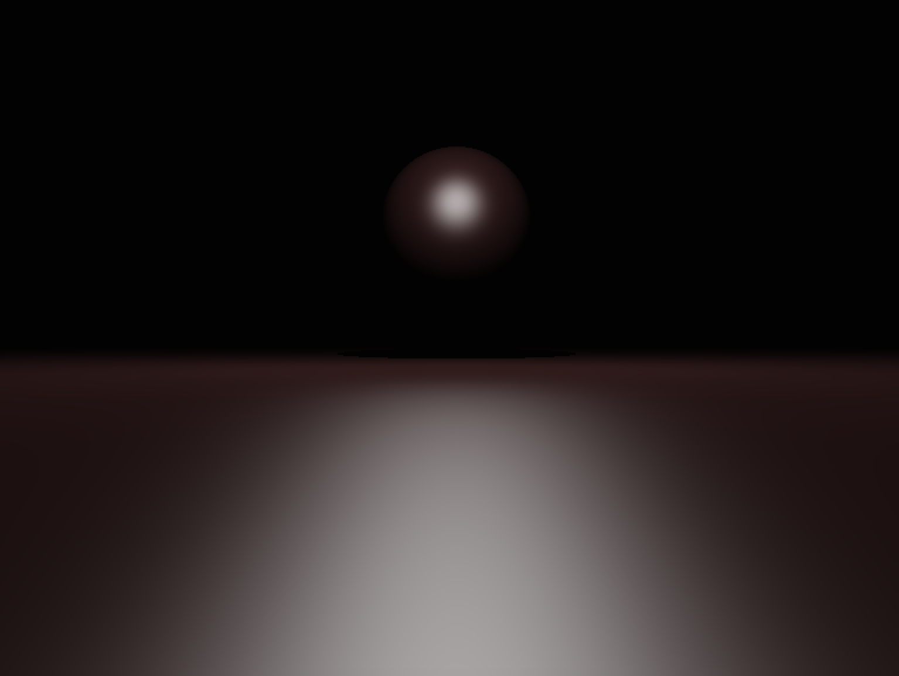
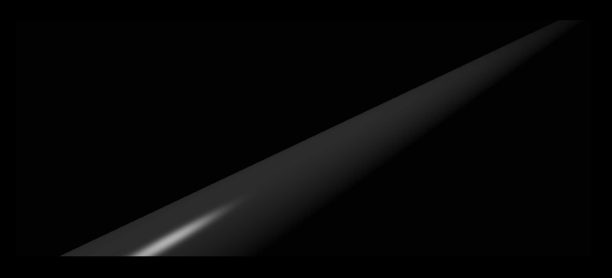
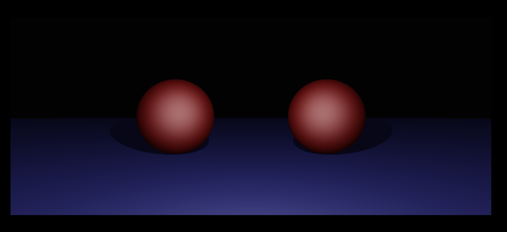
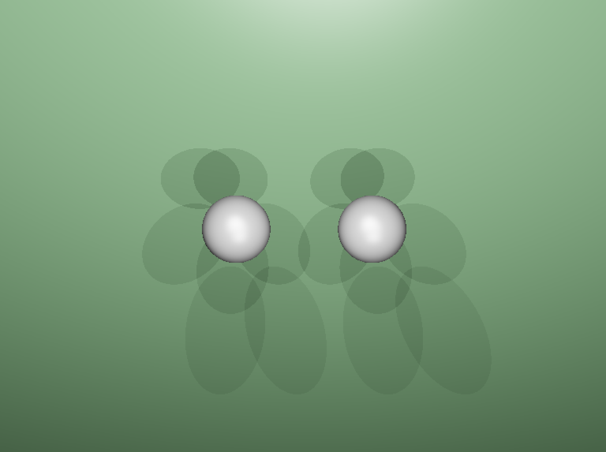
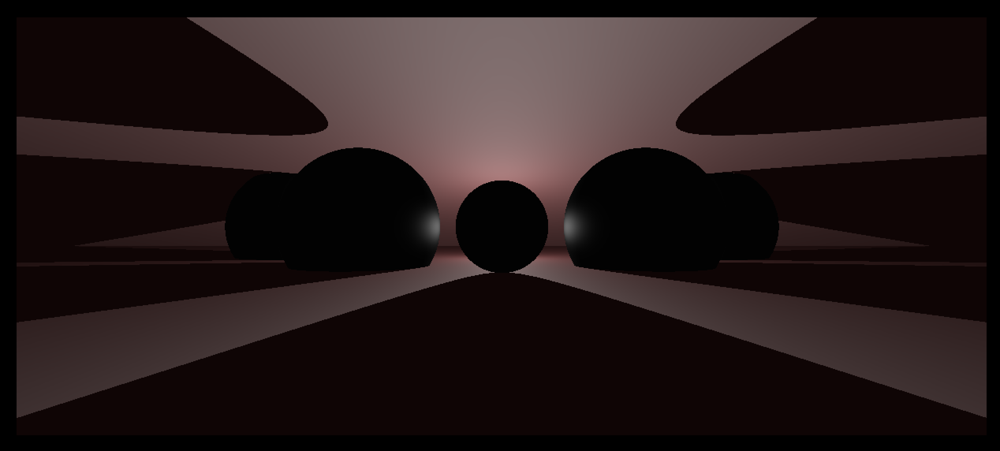

# ray_tracer
Optimized raytracing engine
- pure c
- multithreading
- scene parsing and validation
- 4 basic primitives: Sphere, Plane, Cone, Cylinder
- linear transformations
- configurable Lambert + Phong illumination models
- multiple light spots support

USAGE: ./RTv1 [scenes/CHOOSE_ANY_SCENE]
SCENE SCRIPTING LANGUAGE:

sphere  |[X]:[Y]:[Z]|[RADIUS]|[KA]:[KD]:[KS]|[GS]|[R]:[G]:[B]

plane   |[X]:[Y]:[Z]|[ROT_X]:[ROT_Y]:[ROT_Z]|[KA]:[KD]:[KS]|[GS]|[R]:[G]:[B]

cylinder|[X]:[Y]:[Z]|[RADIUS]|[ROT_X]:[ROT_Y]:[ROT_Z]|[KA]:[KD]:[KS]|[GS]|[R]:[G]:[B]

cone    |[X]:[Y]:[Z]|[RADIUS]|[ROT_X]:[ROT_Y]:[ROT_Z]|[KA]:[KD]:[KS]|[GS]|[R]:[G]:[B]

camera  |[X]:[Y]:[Z]|[ROT_X]:[ROT_Y]:[ROT_Z]

light   |[X]:[Y]:[Z]

...

- no space beetween object_name and |[X]:[Y]....
- there must be at least one cam, one light and one primitive.
- KA - K AMBIENT - (0.0f - 1.0f)
- KD - K DIFFUSE - (0.0f - 1.0f)
- KS - K SPECULAR - (0.0f - 1.0f)
- GS - GAMMA INTERPOLATION FOR SPECULAR - (0 - 500)
- RGB - COLOR (0 - 255)

